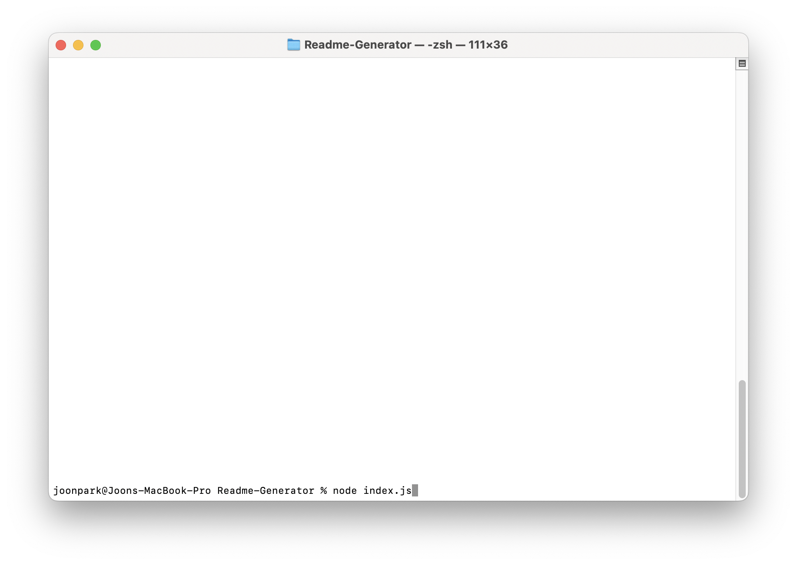
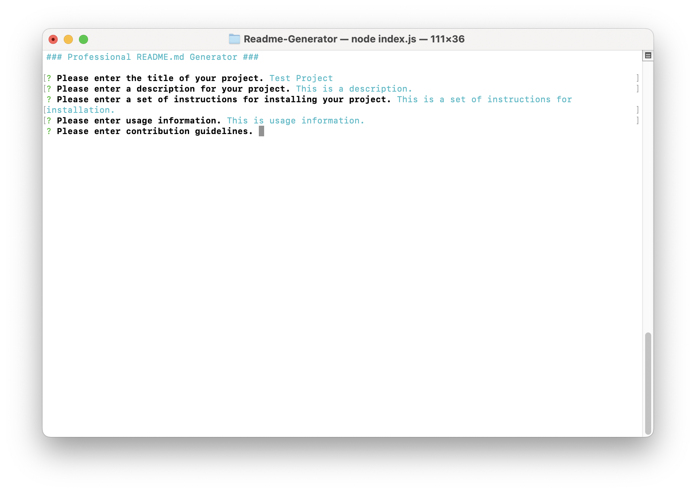
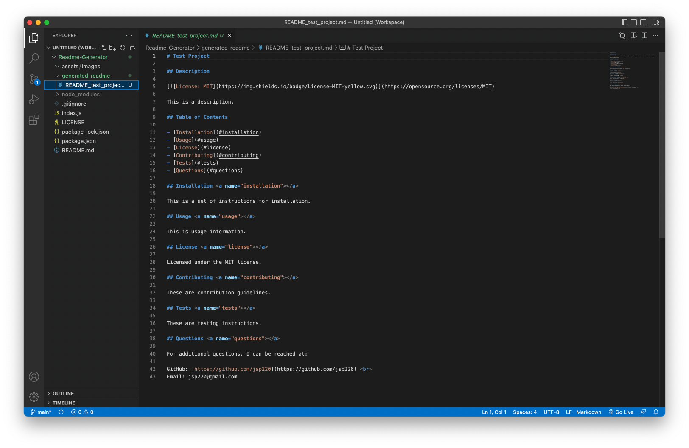

# Readme-Generator

## Description

[](https://opensource.org/licenses/MIT)

A script that generates a professional README.md file using command line prompts.

## Usage

Download the index.js file from this repo into a designated folder. Enter the following node command into terminal/command prompt (from the folder containing index.js) to run the application using Node.js:

```shell
node index.js
```



Follow the prompts to enter basic information for your project. 



at the end of the prompts, a readme file will be generated in the generated-readme folder under the name README_<your_project_name>.md.



## License

Licensed under the MIT license.